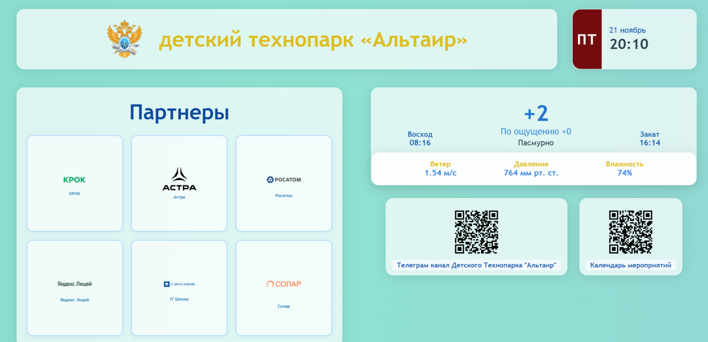

# Saits - инструмент хостинга

> [!NOTE]
> Репозиторий для временного размещения или размещения собвственных статичных сайтов для различных целей
> и тестирования общедоступных веб-сайтов на HTML, CSS и JS. 
> 
> Изначально предназначен для компиляции на страницах github, 
> но на данный момент является интересным инструментом и 
> решением проблем передачи достаточных данных для формирования некоторого

# Текущие директории

Все сайты находяться в поддерикториях, чтобы использую олдну ссылку с приставками добавлять или убавлять какую-то информацию

## Сайт партнеров детского технопарка "Альтаир"

Поступила задача разработки статичного сайта-заглушки для 
интерактивного экрана в детский тезхнопарк "Альтаир" с целью показать наших партнеров и добавить некоторые вспомогательные виджеты

Текущая ссылка сайта - https://voronov-nikita.github.io/saits/pages/partners/

## Сайт - открытка для поздравления

Изначальная идеей страницы было то, чтобы можно было поздравить человека, который находиться довольно далеко через специальную элоектронную открытку с анимацией конфети, вылетающих с краев. 

Шрифт был подлобран наиболее нейтральный по отношению к поздравлению. Текст можно дополнить, а име в фигурных скобках заменить на нормальное.